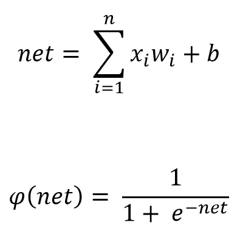

# **Neural networks**

The discipline of neural networks models the human brain. The average human
brain consists of nearly 10^11 neurons of various types, with each neuron connecting
to up to tens of thousands synapses. As such, neural network models are also called
connectionist models. Information processing is mainly in the cerebral cortex, the
outer layer of the brain. Cognitive functions, including language, abstract reasoning,
and learning and memory, represent the most complex brain operations to define in
terms of neural mechanisms.

The neuron, or nerve cell, is the fundamental anatomical and functional unit of the
nervous system including the brain. A neuron is an extension of the simple cell with
two types of appendages: multiple dendrites and an axon. A neuron possesses all
the internal features of a regular cell. A neuron has four components: the dendrites,
the soma (cell body), the axon, and the synapse. A soma contains a cell nucleus.
Dendrites branch into a bushy network around the cell to receive input from other
neurons, whereas the axon stretches out for a long distance, typically a centimeter
and as far as a meter in extreme cases. The axon is an output channel to other
neurons; it branches into strands and substrands to connect to the dendrites and cell
bodies of other neurons. The connecting junction is called a synapse. Each cortical
neuron receives 10^4–10^5 synaptic connections, with most inputs coming from distant
neurons. Thus connections in the cortex are said to exhibit long-range excitation and
short-range inhibition.
A neuron receives signals from other neurons through its soma and dendrites,
integrates them, and sends output signals to other neurons through its axon. The
dendrites receive signals from several neighborhood neurons and pass these onto the
cell body, and are processed therein and the resulting signal is transferred through
an axon.

Neuron is a basic element of neural network. He process input signals and puts output
signal. Model of neuron multiply input signal with correspoding weights. After this recieved values are summarized. Sum transmitted in activation function. There are different types of activation functions. The *McCulloch-Pitts neuron* uses sigmoidal activation function.

So neural network is set of layers that contains neurons.

## **Train**

For getting right results of neural network he must be trained. Training can be perform by using backpropagation error method that based on gradient descent method. Gradient descent method can find minimum of function by going to aim by steps in antigradient direction. Backpropagation algorithm recomputed weights while error function not satisfy required accuracy.

*E* is error function of neural network. *eta* is learning rate or step size, *alpha* is momentum factor (0 < *alpha* <= 1).
